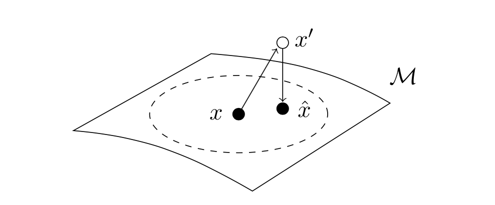

# SSMBA: **S**elf-**S**upervised **M**anifold **B**ased Data **A**ugmentation

## Overview

Self-Supervised Manifold Based Data Augmentation or SSMBA is a semi-supervised data augmentation method that improves both in-domain and out-of-domain performance across multiple models and tasks. SSMBA relies on the assumption that the underlying data clusters around a lower dimensional manifold. A corruption function is applied to perturb a training example off the manifold, then a reconstruction function (typically a denoising autoencoder) is used to project the noised point back onto the
manifold. 

SSMBA is a static augmentation method, meaning all augmentation is completed prior to training. Labels can be generated for these augmented examples either by preserving the labels (which we implement by default here), or by optionally pseudo-labelling with a teacher model. The final labelled examples can be added to the original training examples to form a larger augmented dataset for training.

## SSMBA in NLP

When applied in NLP settings, we apply masked language modeling (MLM) training noise as our corruption function. Specifically, we select a fraction of tokens to apply noise to, then of these tokens, either `<MASK>` them, replace them with a random token, or leave them unchanged. In the original BERT training regime, these percentages are 80% `<MASK>`, 10% random, and 10% unchanged. Once corrupted, we use a BERT model to predict each of the selected tokens and reconstruct the input. 


## How to Use SSMBA

`ssmba.py` is based on the HuggingFace Transformers library and uses BERT models implemented in this library for reconstruction. Any valid BERT model in the [HuggingFace model library](https://huggingface.co/models) can be used, as well as local model paths.

`ssmba.py` takes as input a text file, label file, and reconstruction model, and outputs the augmented data and corresponding preserved labels. If a label file is not provied, only the augmented data is output. We provide an example command below.

```
python ssmba.py \
  --model bert-base-uncased \
  --in-file ${IN_FILE_PATH} \
  --label-file ${LABEL_FILE_PATH} \
  --output-prefix ssmba_out \
  --noise-prob 0.25 \ 
  --num-samples 8 \
  --topk 10
```

This command generates 8 augmented examples for each input example using a noise probability of 0.25. Augmented examples are generated by sampling from the top 10 tokens predicted by the `bert-base-uncased` model.
